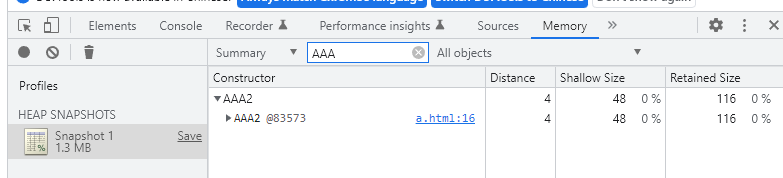

# JS的隐藏类

## 静态语言和动态语言

**💡 JS是一门动态语言，其执行效率要低于静态语言。**


### 一个对象在js和静态语言中的访问
```javascript
// javascript
const person = {
  name: 'scorpion',
  age: 10,
};

console.log(person.name, person.age);
person.sex = 1;

```
```cpp
// c++
struct Person {
    string name;
    int age;
}

Person person;
person.name = "scorpion";
person.age = 10;
// person.sex = 1;  error

```

### 区别

1. 在运行时，js对象的属性可以被修改（新增、删除属性）。当访问person的name属性时，V8并不知道该对象中是否有属性name，也不知道属性name相对于对象的偏移量是多少。
1. js中在查询person对象的name属性时，v8会按照具体规则来查询。
1. c++在代码运行之前要先经过编译，每个struct的形状都是固定的。
1. 在c++中访问person的name属性时，由于形状固定，编译器会直接将name相对于person的地址写进汇编指令中。CPU可以直接去内存地址中取出该内容即可，无中间查找环节。

## Hidden Class：将js中的对象静态化  
**💡 如何将静态语言中对象的静态化特性引入的js中？目前的思路就是将js中的对象静态化，在V8运行js的	过程中会假设js中的对象都是静态的：**

1. 对象创建好后不会添加新的属性；
1. 对象创建好后不会删除属性；

✅ 一旦满足了这两个条件，V8就能对js中的对象做深度优化：V8会为每个对象创建一个隐藏类，对象的隐藏类中记录了该对象的一些基础信息：
1. 对象中的所有属性；
2. 每个属性相对于对象的偏移量；


### 有了Hidden Class后的属性访问
有了隐藏类后，当V8访问某个对象的属性时，就会先去隐藏类中查找属性相对于该对象的偏移量，有了偏移量之后V8就可以直接去内存中取出属性值而不需要经过一系列查找的过程。

### Hidden Class是如何工作的
```javascript
const person = {
  name: 'scorpion',
  age: 10,
}
```
在上面的代码中，V8会为person创建一个隐藏类（map对象），每个对象都会有一个map属性，其值指向内存中的隐藏类。
如之前所说隐藏类记录着了对象的属性布局，包括每个属性名和所对应的偏移量。person对象的隐藏类就包含了name和age属性。假设name的偏移量是4，age的偏移量是8。
person对象map（hidden class）：

| attr | offset |
| --- | --- |
| name | 4 |
| age | 8 |

上表示person对象的map，并不是person本身。person：

| 0x566082c7b91 | map |
| --- | --- |
| 0x566082c7b95 | "scorpion" |
| 0x566082c7b99 | 10 |

### 通过d8查看隐藏类。
```javascript
const person = {
  name: "scorpion",
  age: 10,
};
%DebugPrint(person);

// d8 --allow-natives-syntax ./person.js
```
> DebugPrint: 0x2570810a4a5: [JS_OBJECT_TYPE]
>  - map: 0x0257082c7b91 <Map(HOLEY_ELEMENTS)> [FastProperties]
>  - prototype: 0x025708284245 <Object map = 0x257082c21b9>
>  - elements: 0x02570800222d <FixedArray[0]> [HOLEY_ELEMENTS]
>  - properties: 0x02570800222d <FixedArray[0]>
>  - All own properties (excluding elements): {
>     0x25708004e4d: [String] in ReadOnlySpace: #name: 0x0257082933d9 <String[8]: #scorpion> (const data field 0), location: in-object
>     0x257082933ed: [String] in OldSpace: #age: 10 (const data field 1), location: in-object
>  }
> 0x257082c7b91: [Map]
>  - type: JS_OBJECT_TYPE
>  - instance size: 20
>  - inobject properties: 2
>  - elements kind: HOLEY_ELEMENTS
>  - unused property fields: 0
>  - enum length: invalid
>  - stable_map
>  - back pointer: 0x0257082c7b69 <Map(HOLEY_ELEMENTS)>
>  - prototype_validity cell: 0x0257082044fd <Cell value= 1>
>  - instance descriptors (own) #2: 0x02570810a4d5 <DescriptorArray[2]>
>  - prototype: 0x025708284245 <Object map = 0x257082c21b9>
>  - constructor: 0x025708283e59 <JSFunction Object (sfi = 0x2570820b101)>
>  - dependent code: 0x0257080021b9 <Other heap object (WEAK_FIXED_ARRAY_TYPE)>
>  - construction counter: 0

可以看到person对象的第一个属性就是map，指向了0x257082c7b91这个地址。这个地址就是v8为person对象创建的隐藏类。

#### 多对象公用隐藏类

- 之前提到V8会为每个对象创建一个隐藏类，对于两个形状相同的对象，V8会复用隐藏类：

1. 减少隐藏类的创建次数
1. 减少隐藏类占用的内存空间

- 对象怎样才算相同：

1. 相同的属性名称
1. 相同的属性个数
1. 使用字面量初始化对象时，属性顺序一致。
```javascript
const person = {
  name: "scorpion",
  age: 10,
};
const person2 = {
  name: "scorpion",
  age: 10,
};
%DebugPrint(person);
%DebugPrint(person2);

```
> DebugPrint: 0x2c940810a4f1: [JS_OBJECT_TYPE]
>  - map: 0x2c94082c7b91 <Map(HOLEY_ELEMENTS)> [FastProperties]
>  ...
>  }
> 0x2c94082c7b91: [Map]
>  - type: JS_OBJECT_TYPE
>  ...
>  - inobject properties: 2
>  ...
> 
> DebugPrint: 0x2c940810a549: [JS_OBJECT_TYPE]
>  - map: 0x2c94082c7b91 <Map(HOLEY_ELEMENTS)> [FastProperties]
>  ...
>  }
> 0x2c94082c7b91: [Map]
>  - type: JS_OBJECT_TYPE
>  ...
>  - inobject properties: 2
>  ...


#### 隐藏类的重建
上述所说的看起来很美好，但一切都是建立在之前所提的两个假设条件：
1. 对象创建好后不会添加新的属性；
2. 对象创建好后不会删除属性；
然而就像文章开头所说，js是一门动态语言，在执行过程中对象的属性时可以被任意改变的。一旦某个对象的形状改变，隐藏类也会随着改变。V8会为改变后的对象创建新的隐藏类。  

```javascript
const person = {};
%DebugPrint(person);
person.name = "scorpion";
%DebugPrint(person);
person.age = 10;
%DebugPrint(person);
```

```
DebugPrint: 0x35220810a4dd: [JS_OBJECT_TYPE]
 - map: 0x3522082c22d1 <Map(HOLEY_ELEMENTS)> [FastProperties]
 ...
0x3522082c22d1: [Map]
 - type: JS_OBJECT_TYPE
 - instance size: 28
 - inobject properties: 4
 ...

DebugPrint: 0x35220810a4dd: [JS_OBJECT_TYPE]
 - map: 0x3522082c7b69 <Map(HOLEY_ELEMENTS)> [FastProperties]
 ...
 }
0x3522082c7b69: [Map]
 - type: JS_OBJECT_TYPE
 - instance size: 28
 - inobject properties: 4
 ...

DebugPrint: 0x35220810a4dd: [JS_OBJECT_TYPE]
 - map: 0x3522082c7b91 <Map(HOLEY_ELEMENTS)> [FastProperties]
 ...
 }
0x3522082c7b91: [Map]
 - type: JS_OBJECT_TYPE
 - instance size: 28
 - inobject properties: 4
 ...
```
## 题外话----JS闭包函数里是包含了词法环境中所有能访问的变量还是只包含函数内部使用的变量？
```javascript
function AAA1() {
    this.name = 'AAA1';
}
function AAA2() {
    this.name = 'AAA2';
}
function fn() {
    var a1 = new AAA1();
    var a2 = new AAA2();
    return function () {
        return a2;
    }
}
var f = fn();
```
**变量a2肯定存在于内存中毋庸置疑，a1会被释放么？**      

<br/>  
<br/>  
<br/>  
<br/>  
<br/>  
<br/>  
<br/>  
<br/>  
<br/>  
<br/>  
<br/>  
<br/>  
<br/>  

**谷歌浏览器（102.0.5005.63）版本下：a1没有在闭包中**  



## 参考资料
> 图解Google V8


